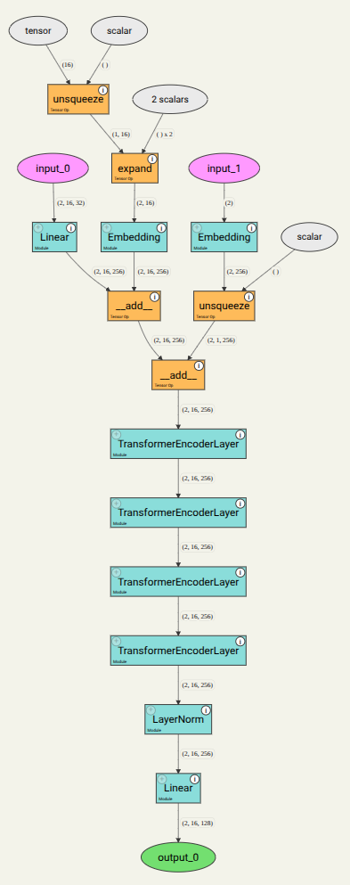
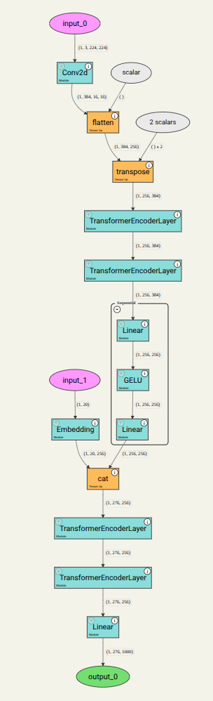

<div align="center">

# 🌟 Explainable Foundation Models

</div>


Injecting explainability directly into the architecture of large-scale foundation models is one of the most active areas of modern AI research. Because foundation models (like Time Series Foundation and Multimodal Large Language Models) rely on billions of parameters and complex latent spaces, achieving transparency requires architectural modifications or tightly integrated sub-modules.

The primary architectural strategies used to build explainability into foundation models include:

### 1. Attention Mechanism Inspection & Native Attributions

* **How it works:** Foundation models predominantly rely on Transformer architectures governed by self-attention mechanisms. By designing the architecture to expose raw attention weights or incorporating native attribution layers (such as Integrated Gradients or Layer-wise Relevance Propagation), developers can trace *which* input tokens or regions the model focused on to generate an output.
* **Application:** In time-series or multimodal settings, this allows you to see precisely which historical timestamps or visual cues triggered a specific decision.

### 2. Concept Bottleneck Architectures

* **How it works:** Instead of forcing the model to map raw inputs (like pixels or raw telemetry streams) directly to a final output in a single black-box leap, a bottleneck layer forces the network to intermediate through human-understandable concepts (e.g., "high traffic density," "pedestrian crossing," or "abnormal deceleration").
* **Application:** The model computes intermediate semantic scores, which are both inspectable by humans and passed along to drive the final decision logic.

### 3. Cross-Modal Bridges & Structured Token Injection

* **How it works:** For multimodal and multi-model systems, explainability can be engineered into the **bridge architecture** connecting distinct foundation models.
* **Application:** As explored in your digital twin architecture, raw numerical outputs, confidence intervals, and feature attributions from a time series foundation model can be structured into explicit contextual text tokens and fed directly into a Multimodal Large Language Model (MLLM). This enables the MLLM to "reason" over quantitative metrics and output natural language explanations natively.

### 4. Probing Classifiers & Latent Space Auditing

* **How it works:** Building modular probe networks alongside the core foundation layers. These lightweight auxiliary classifiers monitor specific activation layers during runtime to decode what internal representations (like velocity patterns or object clusters) the model is currently prioritizing.

---

## 🔍 Explainability: Architecture & Visual Breakdown

<p align="center">
  
</p>

---

## 🌟 Overview

As autonomous driving and smart city infrastructures scale, traditional "black-box" models struggle with safety, interpretability, and long-horizon temporal forecasting. This repository presents an **Explainable Autonomous Cognitive Transportation Digital Twin** that merges state-of-the-art foundation models with real-time digital twin environments[cite: 2]. 

A core innovation of this framework is the seamless synergy between **Time Series Foundation Models** and **Multimodal Large Language Models (MLLMs)**: the predictive and anomaly-detection outputs of the time series foundation models are directly fed into the MLLMs as structured contextual tokens[cite: 2]. This empowers the MLLM to perform advanced semantic reasoning, contextualize temporal trends with visual and textual cues, and output natural language justifications for every driving decision[cite: 2].

## ⚙️ Core Architecture & Technologies

- **Time-Series-to-MLLM Bridge:** Numerical outputs, confidence scores, and feature attributions from time series foundation models are formatted and injected into MLLMs, allowing language models to "reason" over temporal traffic trajectories and anomalies[cite: 2].
- **Multimodal Large Language Models (MLLMs):** Fuse multi-camera video streams, LiDAR inputs, and time-series-derived insights to generate high-level semantic reasoning and natural language justifications[cite: 2].
- **Explainable Time Series Foundation Models:** Leverage pre-trained temporal transformers to capture long-range dependencies, complex traffic flow dynamics, and anomalies with native feature attribution maps[cite: 2].
- **Cognitive Digital Twin Engine:** Simulates complex urban and highway driving ecosystems in real time, synchronizing physical telemetry with virtual environment states[cite: 2].
- **Explainable AI (XAI) Layers:** Translates deep latent representations into human-interpretable metrics, attention heatmaps, and confidence scores[cite: 2].

## 💡Architecture & Use-Case Description

This visualization illustrates a core use case of explainability within an autonomous cognitive transportation digital twin. As the system integrates multi-sensor inputs and real-time time-series telemetry into a multimodal foundation model core, the architecture surfaces transparent attribution maps and attention weights. Rather than operating as a black box, the model translates complex trajectory forecasts and spatial features into clear, auditable decision paths. This enables the multimodal large language model (MLLM) to generate precise natural language justifications—such as explaining why a vehicle autonomously adjusted its speed due to a predicted pedestrian crossing and a temporal congestion spike—ensuring safety, interpretability, and human-aligned trust in smart city environments.

<p align="center">
  
</p>

> *A next-generation digital twin framework bridging real-time traffic simulation, **Explainable Time Series Foundation Models**, and **Multimodal Large Language Models (MLLMs)** for transparent, human-aligned autonomous systems.*

---

## 🚀 Key Features

- **Synergistic Temporal Reasoning:** Bridging quantitative time-series forecasting results with qualitative MLLM reasoning for holistic traffic intelligence[cite: 2].
- **Transparent Decision-Making:** Trace back *why* an autonomous agent made a specific maneuver using integrated MLLM justifications backed by precise time series forecasts[cite: 2].
- **Robust Temporal Forecasting:** Out-of-time-the-box performance on predicting traffic congestion, pedestrian movement, and vehicle trajectories using foundation models[cite: 2].
- **Interactive Digital Twin Environment:** Seamless synchronization between real-time inference pipelines and visualization modules[cite: 2].

---

# 🧠 Typical Foundation Architectures & Visualizations

To achieve glass-box transparency in autonomous cyber-physical systems, our pipeline evaluates two fundamental architectures: TimesFM for high-frequency temporal forecasting and anomaly extraction, and Qwen2-VL for multi-camera spatial grounding and natural language reasoning. For other architectures, these techniques can be extended and applied following the exact same principles.


---

### 📈 1. TimesFM (Time-Series Foundation Model) Architecture

#### Architectural Mechanics

TimesFM utilizes a decoder-only patched-transformer architecture designed for zero-shot time series forecasting. Instead of processing individual timestamps sequentially, it groups contiguous sections of time-series telemetry into non-overlapping patches.

* **Input Patching & Frequency Conditioning:** Converts continuous telemetry streams into fixed-size vector embeddings while injecting frequency indicators.
* **Causal Transformer Decoder Stack:** Captures long-range temporal dependencies across varying sampling rates using stacked causal attention layers.
* **Multi-Step Output Head:** Generates point forecasts and confidence intervals serialized into structured token streams for downstream reasoning.

<p align="center">
  
</p>

> 🔍 **Interactive Exploration:** Want to inspect the layer-by-layer computation graph? You can explore the fully interactive version here:  
> 👉 [View Interactive TimesFM Architecture Graph](https://phamdps.github.io/explainable-fm/timesfm_architecture.html)

---

### 👁️ 2. Qwen2-VL (Multimodal Foundation Model) Architecture

#### Architectural Mechanics

Qwen2-VL provides native dynamic resolution support and multimodal positioning, enabling it to process variable-length video frames and image feeds alongside text tokens seamlessly.

* **Vision Transformer (ViT) Backbone:** Encodes multi-camera spatial layouts and raw pixel data from autonomous vehicle feeds.
* **Dynamic Resolution Projector:** Maps variable aspect ratios directly into the unified latent space without losing fine-grained spatial cues.
* **Unified Cross-Modal Decoder Stack:** Interleaves visual token representations with time-series tokens injected from TimesFM, allowing the language backbone to execute Chain-of-Thought (CoT) reasoning.

<p align="center">
  
</p>

> 🔍 **Interactive Exploration:** Want to trace the vision-to-text fusion layers? You can explore the live graph version here:  
> 👉 [View Interactive Qwen2-VL Architecture Graph](https://phamdps.github.io/explainable-fm/qwen2_vl_architecture.html)

---

## 📂 Repository Structure

```text
├── assets/                  # GIFs, diagrams, and media files
├── src/
│   ├── models/              # Time series foundation models, MLLMs, & bridge modules
│   ├── digital_twin/        # Simulation environment and sensor sync
│   └── xai/                 # Explainability modules and attribution extractors
├── configs/                 # Hyperparameter and model configuration YAMLs
├── scripts/                 # Training, evaluation, and deployment scripts
├── notebooks/               # Interactive tutorials and demo walkthroughs
└── README.md

```
---

## 🛠️ Quick Start

### Prerequisites

* Python 3.10+
* PyTorch 2.0+
* CUDA-enabled GPU recommended for MLLM inference

### Installation

```bash
# Clone the repository
git clone [https://github.com/phamdps/explainable-fm.git](https://github.com/phamdps/explainable-fm.git)
cd explainable-fm

# Install dependencies
pip install -r requirements.txt

```

### Running a Simulation Demo

```bash
python scripts/run_simulation.py --config configs/default_twin.yaml

```

---


## 📄 Citation

If you use this framework or code in your research, please cite our work:

```bibtex
@article{explainable_digital_twin_2026,
  title={Explainable Autonomous Cognitive Transportation Digital Twin using Time Series Foundation Models and MLLMs},
  author={Phuong Pham / Explainable Digital Twin},
  year={2026}
}

```

# 📚 References (2025–2026)

This project builds upon recent milestones in time-series foundation architectures, cross-modal reasoning, large language model traffic adaptation, and transparent digital twin frameworks. The literature is categorized below by core technical pillars:

### 1. Explainable Traffic Forecasting, Driving Behavior & LLMs for Transportation
* **LC-LLM (Peng et al., Communications in Transportation Research, 2025):** *LC-LLM: Explainable Lane-Change Intention and Trajectory Predictions with Large Language Models.* Reformulates vehicle trajectory and lane-change intent forecasting as a language modeling problem, applying supervised fine-tuning and transparent Chain-of-Thought (CoT) step-by-step reasoning.
* **xTP-LLM (Communications in Transportation Research, 2024):** *Towards Explainable Traffic Flow Prediction with Large Language Models.* Integrates multi-modal spatial-temporal data (Points of Interest, weather, historical logs) with Chain-of-Thought reasoning to generate accurate, interpretable traffic volume forecasts.
* **LLM-Augmented Semantic Digital Twins (LSDTs) (2026):** Frameworks merging real-time IoT/telemetry data streams with LLM-driven semantic knowledge graphs to convert unstructured regulatory and spatial rules into executable constraints.

### 2. Explainability, Visual Interpretation & Toolkits for Foundation Models
* **GeoXplain (Koprolin et al., 2026):** *GeoXplain: On-the-Fly Visual Explanations for Weather Foundation Models.* Introduces an interactive Python-based visualization toolkit and model-agnostic result bundle format for exploring geospatial attribution maps, pressure levels, and temporal forecasts across earth-system foundation models like Microsoft Aurora.
* **COFT (ICLR 2026):** *Adapting and Explaining Time Series Foundation Models via Concept Banks.* Introduces concept-based explainability and Concept Activation Vectors (CAVs) using shapelet-based transformations to audit models like Amazon Chronos and MOMENT.
* **Temporal Concept Probing & Attribution Layers (2025–2026):** Methodologies shifting away from black-box post-hoc explainers toward native attention-map extraction and token-level activation auditing for temporal transformers.

### 3. State-of-the-Art Time Series & Earth-System Foundation Models (TSFMs)
* **Amazon Chronos-2 (2025/2026):** T5-based encoder-decoder probabilistic foundation models scaling quantization-based tokenization to treat multi-variate and covariate-informed forecasting as a language modeling task.
* **Salesforce MOIRAI-2 (2025/2026):** Universal decoder-only forecasting architecture utilizing *Any-Variate Attention* to handle dynamic data frequencies and multi-variable structures without fixed input dimensions.
* **Google TimesFM 2.0 (2025/2026):** Patched-decoder foundation models engineered for high long-horizon point accuracy and enterprise reliability.
* **MOMENT (CMU, 2024–2025):** Open-access multi-task foundation models supporting cross-domain forecasting, classification, anomaly detection, and data imputation.

### 4. Multimodal Large Language Models (MLLMs) & Vision-Language Reasoning
* **Qwen2.5-VL & Molmo (2025/2026):** Leading open-weight MLLMs featuring point-level visual grounding, high-information-density processing, and spatial pixel localization critical for edge-agent perception.
* **Time-LLM (2025):** *Time Series Forecasting by Reprogramming Large Language Models.* Establishes the cross-modal bridge paradigm by projecting time-series patches into text-space prototypes to tap into frozen LLM reasoning capabilities.
* **Janus-Pro & GLM-4.6V (2025/2026):** Advanced multimodal architectures handling long-context multi-document data, complex visual feeds, and high-frequency sensor telemetry concurrently.

---

## 📜 License

Distributed under the [MIT License](https://www.google.com/search?q=LICENSE).